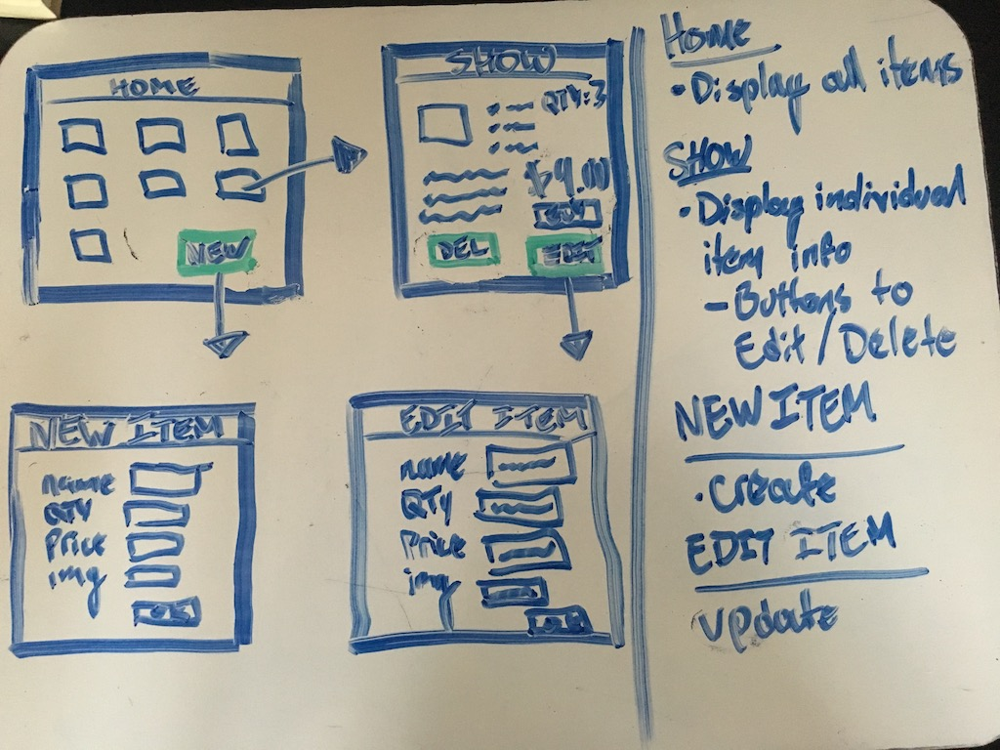
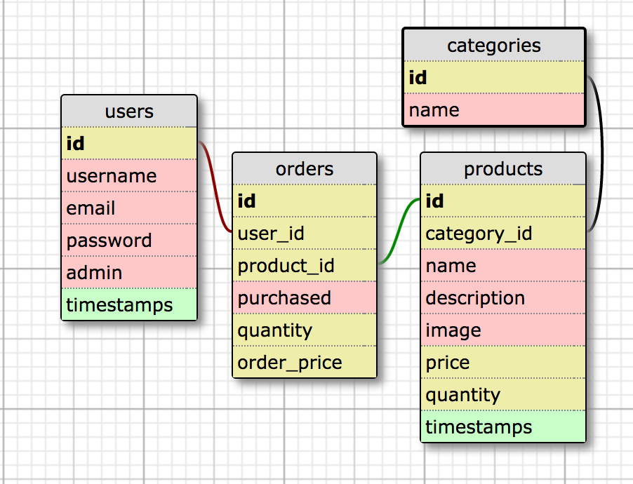

# rails-online-shop README

This README file will document everything implemented in my Rails Online Shop application.

### Mockups

### Schema

### User Stories
* A user can register, sign in, and sign out.
  * User profile will contain Name, Age, and an array containing shopping cart items.
* A user will receive email confirmation upon signing up.
* A user can see a list of available items.
* A user can click on individual items to see more information.
* A user can add items to shopping cart from show page.
* A user can only be given Admin status from another Admin.
* Admin users can modify inventory through a special page available only to Admin users. 
  * Admin users have the ability to Create new items, Read items, Update items, and Delete items.
* A user can checkout items in shopping cart.
  * A successful checkout will update item quantity in stock.

### MVP Iteration 1
* A user can manage products on site.
  * Ability to create, view, edit, and delete.
* A user can see a basic styled site.
* A user can see product placeholders.

